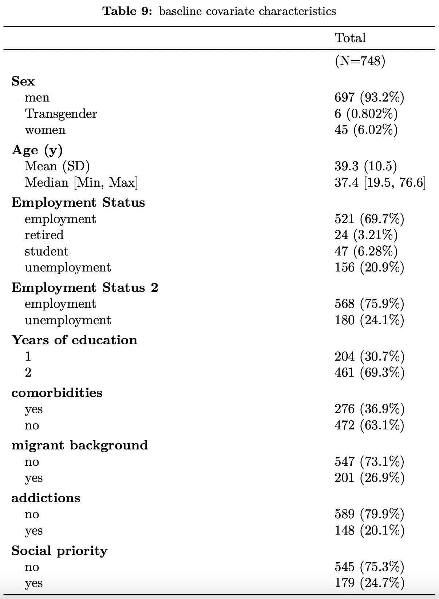
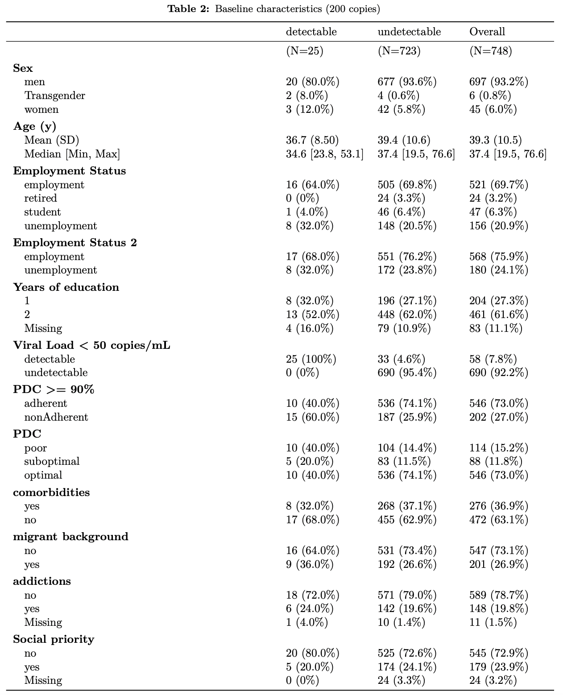

```{r setup, include = FALSE}
library(knitr)
library(tidyverse)
library(tufte)
# set default options
opts_chunk$set(echo = FALSE,
               fig.width = 7.252,
               fig.height = 4,
               dpi = 300)

```

class: title-slide, center, middle

# `r rmarkdown::metadata$title`
<br>
### .black[`r rmarkdown::metadata$author`]

---
class: inverse, middle, center

# "Relationship between socioeconomic status, adherence to antiretroviral therapy and HIV viral suppression"
<br>
<br>
<br>
<br>

.pull-left[
**Dr. Claudia Cortes**

Fundación Arrirán,Chile
]
.pull-right[
**Dr. Barbara Gunsenheimer-Bartmeyer**

Robert Koch Institute

]


---
class: middle

#.charite[Research question]


.my-one-page-font.center[How does **employment status** affect **antiretroviral treatment adherence** and **HIV viral suppression** among patients in a healthcare centre in Chile?]

---
class: remark-slide 
.content-box-green[gggggg]
.Large .Large[This is a .content-box-blue[] chunk.] 144%

```{r, warning=FALSE, message=FALSE, echo= FALSE}
library(knitr)
library(finalfit)
library(kableExtra)
library(table1)
library(formatR)
library(DT)
#library(DT)
#library(readxl)
dataset_thesis <- readRDS("/Users/igna/Documents/R projects/thesis_presentation/documents/data.RData")

label(dataset_thesis$sex) <- "Sex"
label(dataset_thesis$age) <- "Age (y)"
label(dataset_thesis$n_year_education) <- "Years of education"
label(dataset_thesis$empl_status_factor) <- "Employment Status"
label(dataset_thesis$empl_status_3_factor) <- "Employment Status 2"
label(dataset_thesis$VL50.factor) <- "Viral Load < 50 copies/mL"
label(dataset_thesis$VL200.factor) <- "Viral Load < 200 copies/mL"
label(dataset_thesis$PDC2.factor) <- "PDC >= 90%"
label(dataset_thesis$PDC95.factor) <- "PDC >= 95%"
label(dataset_thesis$PDC3.factor) <- "PDC"
label(dataset_thesis$comorbidities) <- "comorbidities"
label(dataset_thesis$addiction) <- "addictions"
label(dataset_thesis$migrant) <- "migrant background"
label(dataset_thesis$social_priority) <- "Social priority"

```


```{css, echo = F}
table {
  font-size: 14px;    
  line-height: 0.5em;
}
```

```{r, warning=FALSE, message=FALSE, echo=FALSE}
demo1 <-table1(~ sex+ age + empl_status_factor + n_year_education +  comorbidities + migrant + addiction + social_priority , overall="Total", render.missing= NULL,
    render.categorical="FREQ (PCTnoNA%)",data= dataset_thesis ,caption="baseline covariate characteristics", footnote="")

kableExtra::kable_styling(t1kable(demo1), bootstrap_options="responsive", stripe_color="white", latex_options = "HOLD_position")%>% 
column_spec(1,width = "8cm", bold = F)
#add_footnote(x1, c("footnote 1", "footnote 2"), notation = "symbol")


#kable(head(dataset_thesis), format = "pipe", # this is the default
# digits = getOption("digits"), row.names = NA, align = 'lrcr',
 # col.names = gsub("[.]", " ", names(dataset_thesis)),  caption = "kable Table")
```
---
# Methodology

## .charite[Data source]
- **Project**: An AI-based computer platform to characterize and identify the level of adherence to treatment among HIV+ people
- Cross-sectional study (Feb-Nov 2021)
  - Self-administer questionnaire
  - Clinical data from pharmacy

---
# Variables
.pull-left[
### .charite[Outcomes/exposure]
- VL at $\leq$ 50 copies/mL and $\leq$ 200 copies/mL
- Proportion of days covered (PDC): Adherence proxy
- Employment status (four or two levels)
   ]
   
.pull-right[
### .charite[Covariates]
- Gender & age (years)
- Level of education (binary based on years)
- Social priority (Metropolitan zone)
- Type of ARV (STR & family)
- Migratory background (binary)
- Commodities (binary)
- Health insurance (strata from A to D)
- Time on ARV (years)
- Homelessness (binary)
- Addictions (address with 1 question)
   ]
---
# Operazionalization
## Proportion of days covered (PDC), AdhereR

```{r}
library(AdhereR)
library(readxl)
pdc <- readxl::read_excel("PDC.xlsx", sheet = 1)

PDC12m <- CMA7(data= pdc, # we're estimating CMA8 now!
             ID.colname="id",
             event.date.colname="date",
             event.duration.colname="days",
             event.daily.dose.colname="perday",
             medication.class.colname="drug",
             carry.only.for.same.medication=TRUE,
             consider.dosage.change=FALSE,
             followup.window.start=0, 
            followup.window.start.unit= "days",
            followup.window.duration= 180,
            observation.window.start= 0, #TO DETERMINE WHEN START, BUT LOOKIN THE NUMBER
            observation.window.start.unit="days",
             observation.window.duration=180,
             date.format= "%m/%d/%Y")

plot(PDC12m, patients.to.plot=c("1"), show.legend= TRUE)
```
---
# Data Analysis 

- Variable selection using Directed Acyclic Graph (DAG) on Dagitty
- Multivariable logistic regression

---
class: inverse, middle, center
# Some results so far
---
class: center, middle
## Variable distribution by VL $\leq$ 50 copies/mL



---
class: center, middle
## Variable distribution by VL $\leq$ 200 copies/mL




---
## Variable selection 
### Minimal sufficient adjustment sets the total effect of Employment status on Viral load and PDC. [See](http://dagitty.net/dags.html?id=UDvDOn)
.pull-left[
- Age (a)
- Gender (g)
- Education Level (e)
- Addiction (ad)
       ]
.pull-right[
- Homelessness (h)
- Commodities (c)
- Migratory background (m)<sup>1</sup>
- Social priority (s)
    ]


###Regression model


> $$\scriptsize \log_e (odds[detectable])=\beta_0 + \beta_{EmpS}\times EmpS + \beta_{a}\times a + \beta_{g}\times g + \beta_{c}\times c + \beta_{e}\times e + \beta_{h}\times h + \beta_{s}\times s + \beta_{m}\times m + s + \beta_{ad}\times ad$$

.center[.footnote[<sup>1</sup> check [Daggity](http://dagitty.net)]]
---
### Domographic
```{css, echo = F}
table {
  font-size: 16px;    
  line-height: 0.7em;
}
```

```{r}
covariates <- readRDS("/Users/igna/Documents/R projects/thesis_presentation/documents/covariates.RData")
covariates$variable[covariates$variable == "sex"] <- "Gender"
covariates$variable[covariates$variable == "age"] <- "Age"

covariates$variable[covariates$variable == "n_year_education"] <- "Education (years)"
covariates$variable[covariates$variable == "Did patient has chornic disease (no = 1, yes = 0 "] <- "Comorbidities"
covariates$variable[covariates$variable == "social_priority"] <- "Social priority"


DT::datatable(covariates, class = "display", rownames = FALSE, options = list(dom = 'tBp', buttons = c("csv","excel"), pageLength = 14))%>% 
  formatStyle(
    1,
    target = "row",
    fontWeight = styleEqual(c("Gender","Age","Education (years)", "Comorbidities","migrant", "addiction","Social priority"), "bold"),
    `font-size`="16px"
  )%>% 
 formatStyle(
    2,
    target = "row",
    fontWeight = styleEqual("(N=748)", "bold"),
    `font-size`="16px"
  )

```

---
### Outcomes
```{r}
outcome <- readRDS("/Users/igna/Documents/R projects/thesis_presentation/documents/outcome.RData")

outcome$variable[outcome$variable == "Adherence status (adh = 0, non_ad = 1"] <- "PDC (95%)"
outcome$variable[outcome$variable == "adherence levels"] <- "PDC levels"

DT::datatable(outcome, class = "display", rownames = FALSE, options = list(dom = 'tBp', buttons = c("csv","excel"), pageLength = 14)) %>% 
  formatStyle(
    1,
    target = "row",
    fontWeight = styleEqual(c("Viral load status (50 cp)","Viral load status (200 cp)","PDC (95%)", "PDC levels"), "bold"),
    `font-size`="16px"
  )%>% 
 formatStyle(
    2,
    target = "row",
    fontWeight = styleEqual("(N=748)", "bold"),
    `font-size`="16px"
  )

```

---
### Exposure

```{r}

exposure <- readRDS("/Users/igna/Documents/R projects/thesis_presentation/documents/exposure.RData")

exposure$variable[exposure$variable == "Employment Status"] <- "Employment Status (4 Levels)"
exposure$variable[exposure$variable == "empl_status_3_factor"] <- "Employment Status (2 Levels)"

#widgetframe::frameWidget(demo)

DT::datatable(exposure, class = "display", rownames = FALSE, options = list(dom = 'tBp', buttons = c("csv","excel"), pageLength = 16))%>% 
 formatStyle(
    1,
    target = "row",
    fontWeight = styleEqual(c("Employment Status (4 Levels)","Employment Status (2 Levels)"), "bold"),
    `font-size`="16px"
  )%>% 
 formatStyle(
    2,
    target = "row",
    fontWeight = styleEqual("(N=748)", "bold"),
    `font-size`="16px"
  )


#demo %>% 
 # DT::datatable(class = "compact", rownames = TRUE, extensions = "Buttons",
             #   options = list(dom = 'tBp', buttons = c("csv","excel"), 
                              # pageLength = 15))
```
---

```{r}

```

